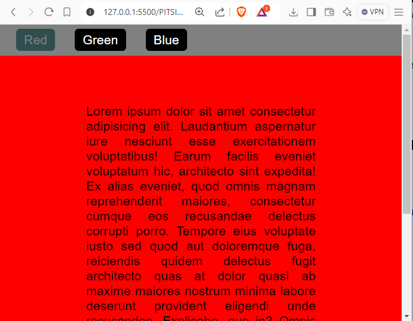
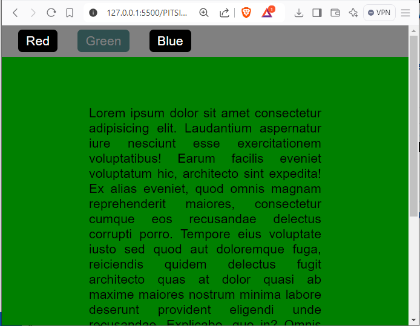
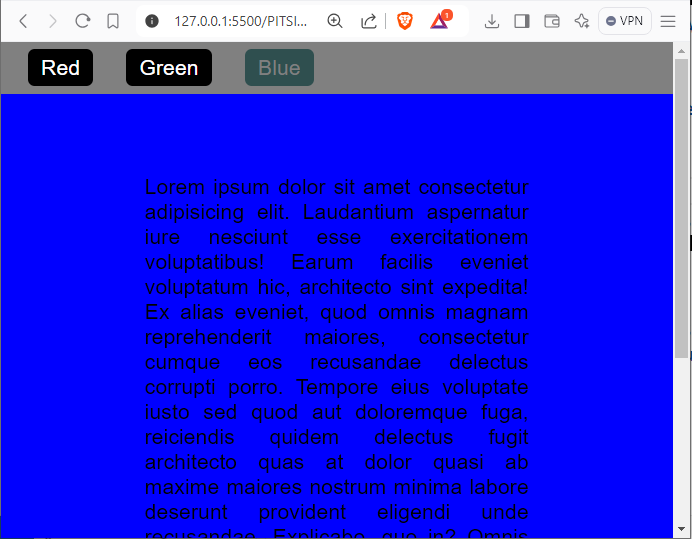

# PITSI308-sprawdzian

Przygotuj trzy podstrony z nawigacją pozwalającą na przenoszenie się między podstronami.

1. Każda podstrona różni się kolorem tła
2. wszystkie zawierają taki sam element nawigacyjny (header)
3. Aktywna strona widczna w menu (wyszarzony i nieaktywny button)

   
   

